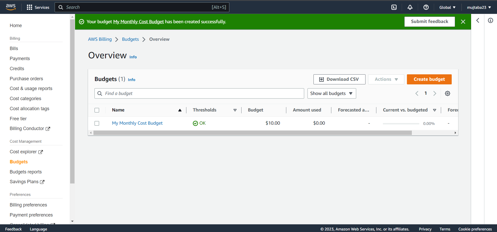

# Week 0 — Billing and Architecture

### Installing AWS CLI in Gitpod
i installed aws cli in gitpod and saved that into branch.

### Create a Budget

I created my own budget for 10 dollor because i cannot afford any spend.
I did not create a secod budget because i was concerned of budget spending going over the 2 budget free limit.

### Recreate Architecture Design

[Lucid Chart Share Link](https://lucid.app/lucidchart/e6a7ad2a-5dfa-42e5-a950-3869b6328c66/edit?viewport_loc=-749%2C-242%2C5120%2C2336%2C0_0&invitationId=inv_73c0c199-c855-4336-81ec-80ebf83294ce)

